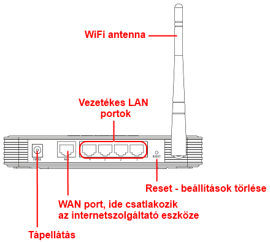
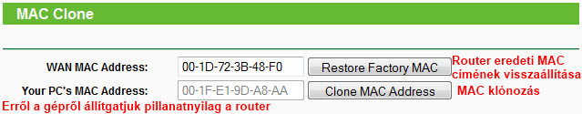
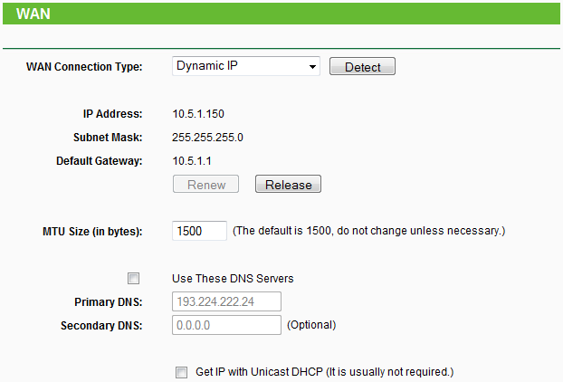
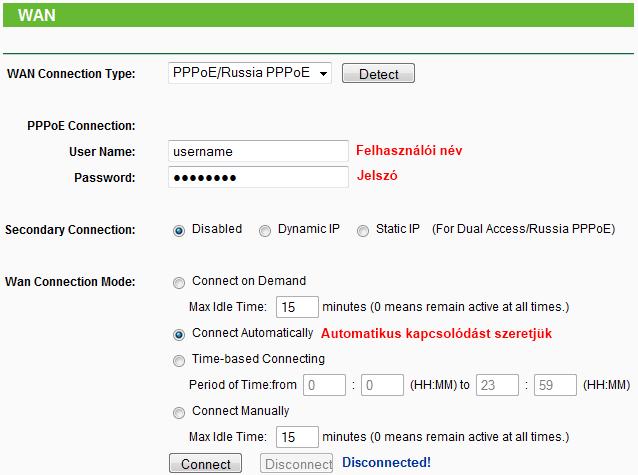
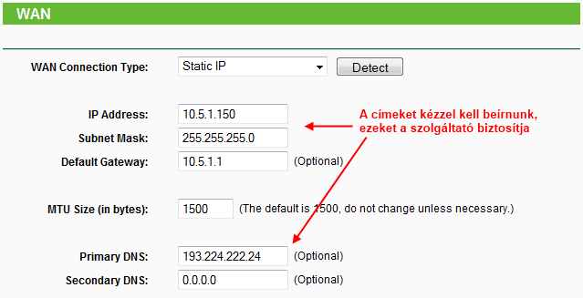

# Router-ek beállítása
TP-Link újratöltve

## Előkészületek
### Hálózati elemek:
* ADSL/Kábel modem vagy egyéb internetcsatlakozási eszköz, aljzat
Router
* Töltsük le hozzá a legfrissebb firmware-t ügyelve a hardververzióra!
* LAN kapcsolódású számítógépek
* WiFi kapcsolódású számítógépek
* Hálózati kábelek (CAT5e patch)
* Ha szükséges, akkor kiegészítő vezetékes, vezeték nélküli hálózati kártyák

<p style="text-align:center">



</p>

<p style="text-align:center">Router csatlakozási pontjai</p>

### Hálózat hardveres kiépítése
* Ha szeretnénk használni W-Fi kapcsolatot, akkor úgy helyezzük el a routert, hogy a lehető legjobb rálátás legyen az eszközökről a routerre, illetve a router antennája felfelé álljon!
* Kössük össze a routert és az ADSL/Kábel modemet a routerrel! A modemen egyetlen RJ-45-ös (LAN) csatlakozó van, ezt kössük össze a router WAN portjával!
* Csatlakoztassunk egy számítógépet (hálózati kártya szükséges, hogy legyen a számítógépben) az 1-es LAN porton keresztül a routerbe! (Alaphelyzetben a Wi-Fi le van tiltva a routerekben, így azon keresztül nem tudjuk beállítani.)
* Kapcsoljuk be a modemet, várjuk meg, amíg kiépíti a kapcsolatát.
* Kapcsoljuk be a routert, szintán várjuk meg, míg bebootol.

### Mire lesz még szükségünk
Router alján, dobozán, kézikönyvében utána kell nézni a **router IP** címének és a hozzáféréshez szükséges **felhasználói névnek és jelszó**nak (user, password, ilyesmi).

## Router elérése, reset, firmware-frissítés
### 192.168.1.1, azaz a router IP-je!
Indítsuk el kedvenc böngészőnket, majd a címsorba gépeljük be a routerünk IP címét, üssünk [ENTER]-t! Párbeszédpanelnak kell megjelennie, ahol kéri a felhasználónevet és a jelszavat. TP-Link esetében ez admin és admin, nyomjunk OK-t. Bent is vagyunk a routerben!
Ha ez mégse lenne így, akkor be kell állítani egy fix IP-t azon a számítógépen, amivel a beállításokat végezzük, az IP-címnek a router IP címével azonos tartományban kell lennie, alhálózati maszk 255.255.255.0 lesz.

> Nem minden esetben ugyanez az alapértelmezett IP címe a router-nek, alján vagy valamerre fogjuk megtalálni ezt az információt a helyes felhasználónévvel és jelszóval

### Firmware-frissítés
> **Firmware-t verőfényes napsütésben, nem bejelentett áramszünet környékén, illetve lehetőleg szünetmentes áramforrásra csatlakozva frissítsünk!
Ha bárkinek elszúródik a frissítése, azért nem vállalok felelősséget!**

Igaz, hogy most jött ki az eszközünk a gyárból, de nem árthat, ha azonnal reseteljük. Ennek menete többféle lehet, teljesség igénye nélkül:
* Áramtalanított router --> benyomjuk a resetet, nyomva tartjuk --> áramot adunk a routernek, továbbra is nyomjuk a resetet --> mikor felvillantak a LED-ek egyszerre, elengedjük;
* Bekapcsolt router --> nyomva tartjuk a resetet --> mikor felvillantak a LED-ek egyszerre, elengedjük;
Fontos az is, hogy **még véletlenül se legyen plusz eszköz csatlakoztatva a routerre, valamint az a számítógép is vezetékkel kapcsolódjon**, amiről a frissítést végezzük!
TP-Link routerekben a frissítést a System Tools --> Firmware Upgrade pontban találjuk. A művelet egyszerű, csak be kell tallóznunk a letöltött firmware-t, majd rákattintani az Upgrade gombra. Talán világos, hogy nem akkor kellene, mikor vihar dúl kint, és persze az sem árt, ha meg tudunk arról győződni, hogy hibátlan a letöltött fájl (hash, vagy ha ZIP fájlban töltöttük le, és ki tudjuk csomagolni, akkor rendben van). Várjunk türelmesen, míg be nem fejeződik a folyamat, esetleg, ha már 15 perce nem csinál semmit, akkor újraindíthatjuk kézzel is (áramtalanítás).
Ha nem indul el a routerünk, adjunk neki egy resetet, ha ezután sem, akkor kaptunk egy téglát. A firmware-t sok esetben helyre lehet állítani, de elég gyakran csak hardveres beavatkozással (bővebben: Google).

## Internetkapcsolat beállítása (Network --> WAN)
> Kinek milyen van? Válassza ki a legördülő listából!

### Dynamic IP (kábelnetes hálózatokon)

<p style="text-align:center">



</p>

**Network --> MAC Clone**, itt kell kezdenünk a beállítását, hiszen kábelnetes hálózatoknál MAC alapú azonosítást alkalmaznak a szolgáltatók. Ha arról a gépről állítjuk a routert, amelyre először csatlakoztattuk a kábelmodemet, akkor szimplán nyomjunk rá a **Clone MAC Address** gombra, majd mentsük el.
Amennyiben egy másik gépről állítjuk, akkor:

* Windows: ```[WIN] + R --> cmd --> ipconfig /all```
* Linux [Ubuntu]: ```Alkalmazások --> Kellékek --> Terminál --> ifconfig```

A megjelenő zagyvaságokból kell levadásznunk a megfelelő hálózati kártya MAC (fizikai) címét, majd a helyes formában beírni az űrlap megfelelő mezőjébe (természetesen menteni kell, később ezt nem is hangsúlyoznám).

<p style="text-align:center">



</p>

Amennyiben sikerült a klónozás, menjünk vissza a Network --> WAN részhez, jelöljük ki a Dynamic IP, mentsük el, aztán nyomjunk rá a Renew gombra!

### PPPoE (ADSL, egyéb)

<p style="text-align:center">



</p>

Ebben az esetben elő kell szednünk azokat az azonosítókat, amiket a szolgáltató adott nekünk.
* Megadjuk a felhasználói nevünket és a jelszavunkat;
* Secondary Connection: Disabled;
* Wan Connection Mode: Connect Automatically;
* Save, Connect;

### Static IP

<p style="text-align:center">



</p>

Ha a szolgáltatónk adott egy csomó számot tartalmazó papírt nekünk, akkor jó eséllyel ezt kell választanunk.
* **IP Address** - IP cím
* **Subnet Mask** - Alhálózati maszk
* **Default Gateway** - Alapértelmezett átjáró
* **Primary DNS** - Elsődleges DNS-kiszolgáló
* **Secondary DNS** - Másodlagos DNS-kiszolgáló
Ha az ISP csak 4 sornyi számot adott meg, akkor az első négy sorba írjuk be őket, azonos sorrendben, természetesen a pontok sem véletlenül vannak a számok között.

### Fontos

**Az MTU-t minden esetben hagyjuk alapon, csak akkor változtassuk meg, ha külön elő van írva.**
Feltétlenül ellenőrizzük, hogy a **router tűzfala be van-e kapcsolva**: Security --> Basic Security --> SPI Firewall: Enable!

