# Access Point-ok
Hogy mik vannak!

## Ezmiez?
Az AP-ok a Wireless router-ekhez hasonlóan különálló, illesztő programot nem igénylő vezeték nélküli hardverek azzal a különbséggel, hogy nem internetmegosztásra találták ki őket, hanem széleskörű vezeték nélküli kommunikációra általában más vezeték nélküli vagy vezetékes hálózatokkal.
A leggyakrabban vezetékes hálózatokhoz csatlakozik, hogy a hálózat képes legyen vezeték nélküli hálózatokkal is kommunikálni.

Miért vegyek Access Point–ot, mikor a Wireless hálózati adaptereket (PCI, USB, PCMCIA) az ára feléért, vagy még olcsóbban megvásárolhatom?
* A fent említett, adapterektől eltérően egyáltalán nem terheli a rendszerüket.
* Platform-függetlenség: nem kell vért izzadnunk, mire illesztő programot találunk régebbi rendszereinkhez (jó eséllyel nem is fogunk találni), pl.: Linux, Win98 Gold vagy SE, Win95 OSR, OS2/Warp, Unix, stb.
* Költséghatékonyabb lehet, ha meglévő vezetékes rendszerünket akarjuk vezeték nélküli hálózathoz csatlakoztatni (nem kell minden számítógépünkbe adaptert vásárolni).
* A működéséhez nem kell külön számítógép.
* A Wireless jelveszteség melegágya a minél hosszabb koax kábel. Nem véletlen, hogy a legtöbb kültéri antennához csak 1 m kábelt mellékel a gyártó, így van ez a TP-Link gyártmányú külső és belső antennáknál is. Ha belegondolunk, milyen helyen van jelenleg a leszerelhető antennás PCI adapterünk, és hova tennék az antennát, máris látjuk, hogy az több méter (általában). 3 méter kábel fölött már komoly jelveszteségre lehet számítani. UTP kábelből meg akár 100 méterest is készíthetünk negatív következmények nélkül. Szóval ideális megoldás, ha egymástól távolabbra lévő épületeket akarunk összekötni, ahol a kábelszerelés már nem, vagy csak nagyon nehezen kivitelezhető.

### Megjegyzések:
* A vezeték nélküli router-ek WiFi részét is szokták AP-nak nevezni, ez természetesen így is van, de sajnos ebben az esetben erősen butított AP-ról van szó, mert csak egyfajta módot támogat, a kvázi AP-t. Nincs benne bridge, AP client, repeater, WISP üzemmód, amivel a későbbiekben még részletesebben is foglalkozok majd.
Szinte mindegyik vezeték nélküli router-t könnyedén tejes értékű AP-vé lehetne alakítani, de sajnos ezt a gyártók nem teszik, mert üzleti szemponttól ez nekik „nem bolt”, így ezeket a teljes funkcionalitású AP-ket külön termékként adják el, sokszor érthetetlenül drágábban, mint a kvázi wifi router-eket.
* Számos nyílt forráskódú, Linux alapú firmware-el rendelkező wifi router-t, lelkes fiataloknak modding-olt firmware-ekkel sikerült igazi hálózati svájci bicskává alakítaniuk, ilyen modding-olt firmware-ek pl. az Open-WRT, a DD-WRT, tomato stb.
A firmware cseréjével a következő készülékek teljes értékű AP-vá válnak: Linksys WRT54GL, Asus WL-500gP, FRITZ!Box stb..
Ritkán találkozhatunk olyan wifi router-el is, amiből a gyártó nem gyomlálta ki az összes AP üzemmódot a klasszikus AP-n kívül, például ilyen a legtöbb Edimax is.

## Az AP-k fajtái
### Kültéri
* integrált antennával ellátott
* leszerelhető antennával ellátott
* ezek kombinációja

Megjegyzés: Ezekkel a továbbiakban nem csak azért nem foglalkozok, mert méreg drágák, hanem azért is, mert elsődleges célom inkább az átlag felhasználókkal megismertetni az AP-t, és elsősorban otthoni „konyhai” felhasználási lehetőségeket bemutatni.

## Beltéri
* Fix antennával ellátott
* leszerelhető antennával ellátott

A továbbiakban egy ilyen készülékkel fogunk foglalkozni, ami a TP-Link TL WA601G névre hallgat, ezt fogjuk karöltve használni egy ugyan ilyen készülékkel, illetve egy TP-Link TL-WR642G wifi router-el.

A TP-Link TL-WR642G vezeték nélküli router beállításának leírását (Internetre való felcsatlakozás, vezetékes és vezeték nélküli kliensek beállítása, port átirányítás stb..) http://www.pcworld.hu/forum/index.php?s=&showtopic=13299&view=findpost&p=370619

## TP-Link TL-WA601G

> FIGYELEM! A Wireless titkosítási beállításokat – hogy gyorsabban haladjak - nem írom le minden AP mód esetén, hanem a végére tartogatom. A SAJÁT ÉRDEKÉBEN MINDENKI ÁLLÍTSA BE!

Megjegyzések
* Vegyük figyelembe, hogy nem mindegyik AP mód támogatja az összes titkosítási eljárást, miután konfiguráltuk az eszközt, ezek a beállítások inaktívak maradnak, így elvileg ki sem lehet őket választani.
* Miután kész vagyunk egy panel beállításával, mindig nyomjuk meg a SAVE gombot, ezt nem fogom mindig elmondani a jövőben. Előfordulhat, hogy ennek hatásra mégsem indul újra az elérési pontunk (AP) vagy router-ünk, pedig a módosítások életbelépéséhez szükség lenne rá. Ilyen esetben navigáljunk a System Tools ->reboot menüpontba és nyomjuk meg a reboot gombot.
* Mielőtt mindenki kapkodná a fejét, hogy hogyan tudhatná meg az elérési pontja (AP) vagy vezeték nélküli router-e fizikai (MAC) címét, fordítsa meg a készüléket, és olvassa le a címkéről. Ezen kívül minden menedzselhető TP-Link hálózati eszköznél. ott van a legelső Status menüponton belül.
Hálózati adapterek (PCI, USB, PCMCIA) fizikai címének listázásához:
  1. Start -> Futtatás ->cmd
  2. Adjuk ki a köv. parancsok valamelyikét:
      * ipconfig /all
      * getmac /v (kivéve Win XP home)

### Üzembehelyezés

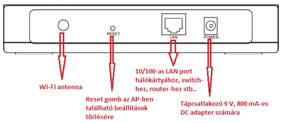

Csavarjuk be a mellékelt (vagy egyéb kül- és beltéri) **SMA R/P csatolású** antennánkat, kössük össze a készülék LAN portját a számítógépünk hálózati kártyájával a mellékelt UTP RJ45 kábellel. (megj.: a készülék **auto MDI/MDI-X képességekkel rendelkezik, így teljesen mindegy hogy egyenes vagy keresztkötésű UTP kábelt használunk)**.

#### Fontos

A router-ek esetében megszokhattuk, hogy a DHCP szerver gyárilag engedélyezve van, így beüzemeléskor nem kellett bajlódni az IP címek beírásával, hanem egyből kapott IP címet az adapterünk, és máris el tudtuk érni az eszköz webes beállító felületét.
Nos, az AP-k is rendelkeznek DHCP szerverrel, viszont alapértelmezésben le van tiltva, ezért mielőtt még áram alá helyeznék az eszközt, manuálisan kell IP címet kiosztanunk a hálózati adapterünknek:

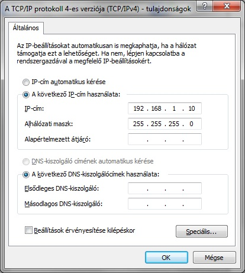

Lépjünk be az AP készülékünk webes felületére:
1. Indítsuk el kedvenc böngészőnket, majd a címsorba gépeljük be: **192.168.1.1**, majd üssünk [ENTER]-t!
2. Párbeszédpanelnak kell megjelennie, ahol kéri a felhasználónevet és a jelszavat. TP-Link esetében ez **admin** és **admin**, nyomjunk **OK**-t. Bent is vagyunk a AP-nkbe!

Első dolgunk a készülék alapértelmezett IP címének megváltoztatása legyen, a későbbi IP ütközések elkerülése végett, Network menü -> LAN

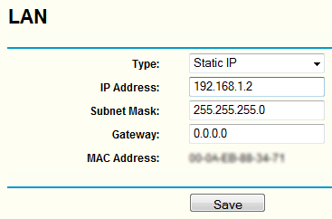

A jövőben majd az itt megadott IP címmel tudjuk elérni a hozzáférési pontunkat.

## Üzemmódok

### AP

Példánkban egy meglévő vezetékes hálózatot, bővítünk egy Acces Point –al.

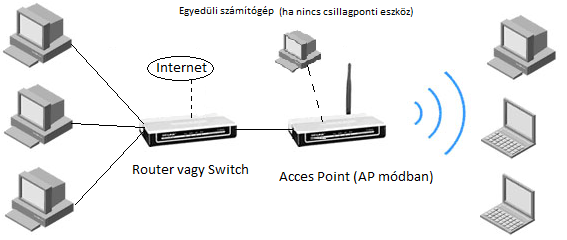

Első lépésben csatlakoztassuk az elérési pontunkat a PC-nkez, routerhez vagy más csillagponti eszközköz. (Értelem szerűen előtte módosítsuk az AP helyi hálózati beállításait a meglévő hálózatunkban alkalmazott alhálózatok szerint: **Network menü -> LAN**)
Lépjünk be az elérési pontunk kezelőfelületébe, a **Wireless -> Basic Settings**-en belül állítsuk be a Vezeték nélküli hálózatunk nevét (SSID), a régiónkat, ill. használni kívánt Wireless csatornát és technológiát.
A **Wireless -> Wireless Mode**-on belül állítsuk be az **Access Point** üzemmódot. Újraindítás után már csatlakozhatunk is a wireless klienseinkkel az újdonsült elérési pontunkhoz. Ha router-t használunk és **engedélyezve van rajta a DHCP**, automatikusan **IP címet fognak kapni az AP kliensek**, és máris lehet Internetezni. Egyéb esetben manuálisan kell azt is konfigurálnunk.

### AP kliens

Példánkban meglévő Wi-fi router –ünkhöz, vagy elérési pontunkhoz csatlakozunk az **AP client** mód segítségével.

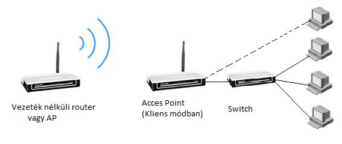

Lépjünk be az elérési pontunk kezelőfelületére. Navigáljuk a **Wireless -> Wireless mode** menüpontba válasszuk ki a **Client** üzemmódot, ha ismerjük az annak az AP-nek a hálózati nevét, vagy fizikai címét, amihez csatlakozni akarunk, töltsük ki a mezőket, ha nem ismerjük ezeket, navigáljunk a lap aljára, és kattintsunk a Survery gombra

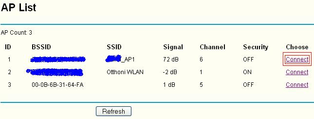

Ha megjelenik a kedvenc AP-k a listában, kattintsunk a **Connect** linkre, ennek hatására automatikusan kitöltődnek a mezők az **AP Client** résznél. A **Save gomb** megnyomásának hatására újraindul az elérési pontunk, és már csatlakoztunk is.
Ha vezeték nélküli router-hez csatlakozunk (vagy olyan AP-hoz, ami vezetékes router-be csatlakozik) meg kell adni az **alapértelmezett átjáró** és a **DNS szerver** IP címét, vagyis a router-ünk IP címét, máskülönben nem tudunk majd a kliens számítógépünkkel Internetezni:

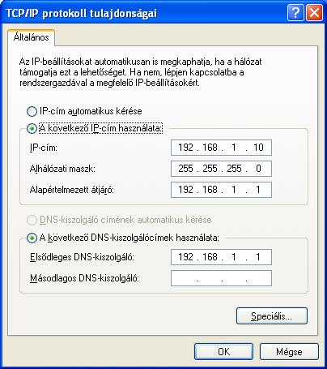

Ha egyszerre több számítógép csatlakozik AP kliensünkhöz pl. switch-en keresztül, akkor érdemes a készülék saját **DHCP szerverét** bekapcsolnunk (**DHCP -> DHCP Settings -> Enable**), de előtte vegyük figyelembe a következőket:
1. A kiosztható IP tartomány **nem egyezhet meg**, a vezeték nélküli router-ünk DHCP tartományával, és **nem is fedhetik át egymást**.
2. Ki kell töltenünk a **Default Gateway** és **Primary DNS** mezőket ami természetesen a **vezeték nélküli router-ünk IP címe lesz**. Ha nem így teszünk, akkor a DHCP szerver a saját (vagyis az AP kliens) IP címét fogja megadni, ami helytelen konfiguráció.

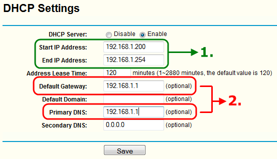

### Repeater (jelismétlő)

Gyakran előfordul, hogy olyan helyen is szükségünk lenne wifi-re, ahol nem (vagy csak nagyon gyengén) fogható vezeték nélküli router-ünk, vagy elérési pontunk rádiójelei. Ebben segít nekünk a Repeater (jelismétlő) funkció. Ha sikeresen bekonfiguráltuk az elérési pontunkat Repeater-ként, már többé nem szükséges az ethernet kábel, bárhová vihetjük, ahol a hálózati áramforrást biztosítani tudjuk számára.

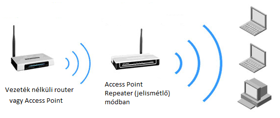

Példánkban egy **WDS** támogatással rendelkező **TP-Link TL-WR642G** vezeték nélküli router elgyengült jeleit fogjuk megismételni, felerősíteni.

1. Lépjünk be az elérési pontunk webes beállító felületére, és a **Network -> LAN** menünél adjuk meg kedvenc router-ünk IP címét, majd Save gomb.

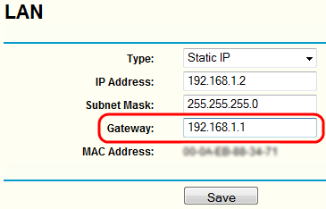

2. Menjünk a **Wireless -> Wireless mode** menübe, állítsuk be a **Repeater** módot, és adjuk meg a **Wifi router-ünk fizikai címét**, vagy keressük meg a router-t a Survery gomb segítségével, ha kész nyomjuk meg a Save, ekkor az AP újraindul.

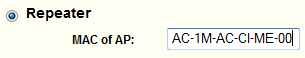

3. Húzzuk ki az elérési pontunkból az UTP kábelt, és vigyük el arra a pontra, ahol gyengül a jel, majd csatlakoztassuk a hálózati áramhoz.

> Fontos: Ha a vezeték nélküli router-ünk **nem támogatja a WDS módot**, az **Universal Repeater módba** kell raktunk az elérési pontunkat.

### Bridge (Point to Point)

A bridge-ek, más néven hidak funkciója a különböző jellemzőkkel rendelkező hálózati rendszerek, például egy Ethernet, és egy Fast Ethernet hálózat összekapcsolása. A hidak feltérképezik az egyes csomópontok (gépek, HUB-ok, stb.) Ethernet címeit, és csak a szükséges forgalmat engedik át a hídon. Mivel ez szétválasztja a két hálózatot önálló ütközési tartományokra, több gépet lehet a hálózatra kötni.

Wireless Bridge, Wireless AP funcióval (is):

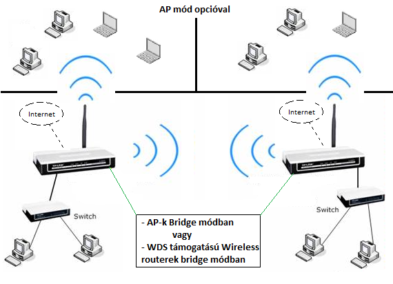

Példánkban egy TP-Link TL-WR642G Wireless router-t fogunk hídba kötni egy TP-Link TL-WA601G elérési ponttal.

* Lépjünk be az elérési pontunk webes felületére. Menjünk a **Wireless -> Wireless mode** menübe, állítsuk be a **Bridge (Point to Point)** módot és **adjuk meg a Wifi router-ünk fizikai címét**.
Opcionális: ha bejelöljük a **With AP Mode** jelölő nézetet elérési pontunk **AP módban is működni fog**.

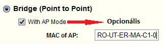

* Lépjünk be a Wifi router-ünk webes beállító felületére. Állítsuk be a **Wireless -> Wireless Settings** menübe a **bridge módot**, majd adjuk meg Bridge (Point to Point) módba állított **elérési pontunk fizikai címét**.

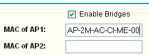

**IP beállítások:**
* Router: alapértelmezett
* AP: LAN IP:192.168.1.2, DHCP kikapcsolva!

Megjegyzések:
* Az AP opció esetén, csak az SSID-ben térhet el egymástól a két elérési pont.
* Titkosításkor a két AP WEP kulcsainak értelem szerűen meg kell egyezni.
* A DHCP-t csak azon a router-en érdemes bekapcsolni, ami az Internetre csatlakozik.
* A TP-Link TL-WR642G wifi router-ünk esetében nem tudjuk elkülöníteni a Bridge és az AP funkciókat, mert nincs rá beállítási lehetőségünk, vagyis a készülék Bridge mellett AP-ként is üzemelni fog.

Ha mindent jól állítottunk be, minden DHCP klienseknek lesz IP címe és internetkapcsolata akár a wifi router-re, akár az AP-re csatlakozik vezetékesen vagy vezeték nélkül.

Hasonlóképpen lehetőségünk van 2 db Wireles router, valamint 2 db AP összekapcsolására. Értelemszerűen a rubrikákba mindig a másik eszköz fizikai címét kell írni.

### Bridge (Point to Multi-Point)

Felszerelés hiányában ezt nem tudtam teszteli, ezért ennek módnak a bemutatása elmarad (egyelőre).

### AP WiFi titkosítás

#### Elérhető titkosítási eljárások a különböző AP üzemmódokban

* **AP, AP kliens:** nincs kompromisszum, a legerősebb titkosítás is elérhető (WPA2-PSK).
* **Repeater, Bridge:** csak a jóval gyengébb WEP elérhető. (Update [2010.05.18.]: Az új N-es és lite N-es TP-Link Acces Point -okkal már ezekben az üzemmódokban is elérhető a WPA2 titkosítás; pl.:TL-WA701ND, TL-WA801ND, TL-WA901ND).
