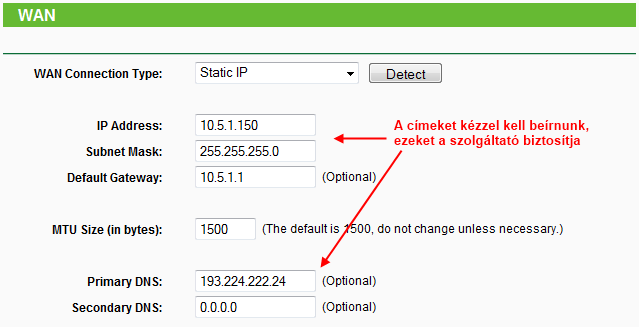

# Router-ek beállítása
TP-Link újratöltve

## Előkészületek
### Hálózati elemek:
* ADSL/Kábel modem vagy egyéb internetcsatlakozási eszköz, aljzat
Router
* Töltsük le hozzá a legfrissebb firmware-t ügyelve a hardververzióra!
* LAN kapcsolódású számítógépek
* WiFi kapcsolódású számítógépek
* Hálózati kábelek (CAT5e patch)
* Ha szükséges, akkor kiegészítő vezetékes, vezeték nélküli hálózati kártyák

<p style="text-align:center">


</p>

<p style="text-align:center">Router csatlakozási pontjai</p>

### Hálózat hardveres kiépítése
* Ha szeretnénk használni W-Fi kapcsolatot, akkor úgy helyezzük el a routert, hogy a lehető legjobb rálátás legyen az eszközökről a routerre, illetve a router antennája felfelé álljon!
* Kössük össze a routert és az ADSL/Kábel modemet a routerrel! A modemen egyetlen RJ-45-ös (LAN) csatlakozó van, ezt kössük össze a router WAN portjával!
* Csatlakoztassunk egy számítógépet (hálózati kártya szükséges, hogy legyen a számítógépben) az 1-es LAN porton keresztül a routerbe! (Alaphelyzetben a Wi-Fi le van tiltva a routerekben, így azon keresztül nem tudjuk beállítani.)
* Kapcsoljuk be a modemet, várjuk meg, amíg kiépíti a kapcsolatát.
* Kapcsoljuk be a routert, szintán várjuk meg, míg bebootol.

### Mire lesz még szükségünk
Router alján, dobozán, kézikönyvében utána kell nézni a **router IP** címének és a hozzáféréshez szükséges **felhasználói névnek és jelszó**nak (user, password, ilyesmi).

## Router elérése, reset, firmware-frissítés
### 192.168.1.1, azaz a router IP-je!
Indítsuk el kedvenc böngészőnket, majd a címsorba gépeljük be a routerünk IP címét, üssünk [ENTER]-t! Párbeszédpanelnak kell megjelennie, ahol kéri a felhasználónevet és a jelszavat. TP-Link esetében ez admin és admin, nyomjunk OK-t. Bent is vagyunk a routerben!
Ha ez mégse lenne így, akkor be kell állítani egy fix IP-t azon a számítógépen, amivel a beállításokat végezzük, az IP-címnek a router IP címével azonos tartományban kell lennie, alhálózati maszk 255.255.255.0 lesz.

> Nem minden esetben ugyanez az alapértelmezett IP címe a router-nek, alján vagy valamerre fogjuk megtalálni ezt az információt a helyes felhasználónévvel és jelszóval

### Firmware-frissítés
> **Firmware-t verőfényes napsütésben, nem bejelentett áramszünet környékén, illetve lehetőleg szünetmentes áramforrásra csatlakozva frissítsünk!
Ha bárkinek elszúródik a frissítése, azért nem vállalok felelősséget!**

Igaz, hogy most jött ki az eszközünk a gyárból, de nem árthat, ha azonnal reseteljük. Ennek menete többféle lehet, teljesség igénye nélkül:
* Áramtalanított router --> benyomjuk a resetet, nyomva tartjuk --> áramot adunk a routernek, továbbra is nyomjuk a resetet --> mikor felvillantak a LED-ek egyszerre, elengedjük;
* Bekapcsolt router --> nyomva tartjuk a resetet --> mikor felvillantak a LED-ek egyszerre, elengedjük;
Fontos az is, hogy **még véletlenül se legyen plusz eszköz csatlakoztatva a routerre, valamint az a számítógép is vezetékkel kapcsolódjon**, amiről a frissítést végezzük!
TP-Link routerekben a frissítést a System Tools --> Firmware Upgrade pontban találjuk. A művelet egyszerű, csak be kell tallóznunk a letöltött firmware-t, majd rákattintani az Upgrade gombra. Talán világos, hogy nem akkor kellene, mikor vihar dúl kint, és persze az sem árt, ha meg tudunk arról győződni, hogy hibátlan a letöltött fájl (hash, vagy ha ZIP fájlban töltöttük le, és ki tudjuk csomagolni, akkor rendben van). Várjunk türelmesen, míg be nem fejeződik a folyamat, esetleg, ha már 15 perce nem csinál semmit, akkor újraindíthatjuk kézzel is (áramtalanítás).
Ha nem indul el a routerünk, adjunk neki egy resetet, ha ezután sem, akkor kaptunk egy téglát. A firmware-t sok esetben helyre lehet állítani, de elég gyakran csak hardveres beavatkozással (bővebben: Google).

## Internetkapcsolat beállítása (Network --> WAN)
> Kinek milyen van? Válassza ki a legördülő listából!

### Dynamic IP (kábelnetes hálózatokon)

<p style="text-align:center">


</p>

**Network --> MAC Clone**, itt kell kezdenünk a beállítását, hiszen kábelnetes hálózatoknál MAC alapú azonosítást alkalmaznak a szolgáltatók. Ha arról a gépről állítjuk a routert, amelyre először csatlakoztattuk a kábelmodemet, akkor szimplán nyomjunk rá a **Clone MAC Address** gombra, majd mentsük el.
Amennyiben egy másik gépről állítjuk, akkor:

* Windows: ```[WIN] + R --> cmd --> ipconfig /all```
* Linux [Ubuntu]: ```Alkalmazások --> Kellékek --> Terminál --> ifconfig```

A megjelenő zagyvaságokból kell levadásznunk a megfelelő hálózati kártya MAC (fizikai) címét, majd a helyes formában beírni az űrlap megfelelő mezőjébe (természetesen menteni kell, később ezt nem is hangsúlyoznám).

<p style="text-align:center">


</p>

Amennyiben sikerült a klónozás, menjünk vissza a Network --> WAN részhez, jelöljük ki a Dynamic IP, mentsük el, aztán nyomjunk rá a Renew gombra!

### PPPoE (ADSL, egyéb)

<p style="text-align:center">


</p>

Ebben az esetben elő kell szednünk azokat az azonosítókat, amiket a szolgáltató adott nekünk.
* Megadjuk a felhasználói nevünket és a jelszavunkat;
* Secondary Connection: Disabled;
* Wan Connection Mode: Connect Automatically;
* Save, Connect;

### Static IP

<p style="text-align:center">



</p>

Ha a szolgáltatónk adott egy csomó számot tartalmazó papírt nekünk, akkor jó eséllyel ezt kell választanunk.
* **IP Address** - IP cím
* **Subnet Mask** - Alhálózati maszk
* **Default Gateway** - Alapértelmezett átjáró
* **Primary DNS** - Elsődleges DNS-kiszolgáló
* **Secondary DNS** - Másodlagos DNS-kiszolgáló
Ha az ISP csak 4 sornyi számot adott meg, akkor az első négy sorba írjuk be őket, azonos sorrendben, természetesen a pontok sem véletlenül vannak a számok között.

### Fontos

**Az MTU-t minden esetben hagyjuk alapon, csak akkor változtassuk meg, ha külön elő van írva.**
Feltétlenül ellenőrizzük, hogy a **router tűzfala be van-e kapcsolva**: Security --> Basic Security --> SPI Firewall: Enable!

## Helyi hálózat
WiFi, LAN és ami még velük jár

Router és a kliensek címei

<p style="text-align:center">


</p>

**Network --> LAN** résznél mindent hagyhatunk alapon, különleges helyzetekben kell megváltoztatni a router IP-jét, most nekünk tökéletes lesz így.

<p style="text-align:center">


</p>

Következő állomás a DHCP részleg. Talán triviális, hogy ha adatokat akarunk eljuttatni A-ból B-be (és fordítva), akkor mindkét végpontnak ismerni kell a címét. A-ét már ismerjük, ez a router 192.168.1.1-es IP-je. Most a kliensek címeit fogjuk beállítani, mégpedig DHCP segítségével. Ennek az "egységnek" a feladata címekkel ellátni azokat az eszközöket, amelyek kérik ezt.

* **DHCP Server:** Enable
* **Start és End IP Address:** kezdő és végcím, ha a router IP-je 192.168.1.1 és az alhálózati maszkja 255.255.255.0, akkor ez 192.168.1.2-től egészen 192.168.1.254-ig terjedhet.
* **Address Lease Time:** címbérleti időt jelent. A megadott ideig birtokolják a gépek a kapott IP-címeket.
* **Default Gateway:** ide kerül a router IP-je, ezt, és a fennmaradó beállítást sem kell piszkálnunk alapesetben.

Ha a DHCP-t így állítjuk be, akkor a csatlakoztatott gépek (vezetékkel vagy vezeték nélkül) kapni fognak IP címet, elérhetőek lesznek a belső hálózatunkon.

<p style="text-align:center">


</p>

**Address Reservation** pontban még találunk egy kis érdekességet. Itt tudunk a gépeinkhez fix IP-t rendelni, így bármikor kapcsolódunk, ugyanazt a címet kapjuk. **Add New** gombra kattintva egy újabb űrlap fogad bennünket, amit értelem szerűen ki kell töltenünk. A **MAC** címet a fent már leírt (WAN) módokon kérdezhetjük le, **Reserved IP Address** mezőbe pedig a **kívánt IP**-t kell beírnunk, ennek a a **DHCP szerver címtartományán belül kell lennie**.

Nem kellene feltétlenül DHCP-t használnunk, beállítgathatnánk egyesével is a kívánt címeket az összes gépen, de az túl macerás. A Microsoft nem azért csinálta, hogy megkeserítse az életünket, épp fordítva!

## Port forwarding - portátirányítás
Fránya torrent

> A portátirányítás arra való, hogy egy külső kérést a megfelelő belső gépre irányítsunk.

### Forwarding --> UPnP

<p style="text-align:center">


</p>

Legegyszerűbb módja a portnyitásnak, de arra figyelnünk kell, hogy csak UPnP kompatibilis szoftverek tudják majd használni. Ha uTorrent-nek szeretnénk portot nyitni, válasszuk ezt a megoldást. A routerben csak ki és bekapcsolásra van szükség, de a programokban sem lesz bonyolultabb beállítani, hiszen az egész lényege, hogy automatán nyit portot (plug'n'play).

### Forwarding --> Port Triggering

<p style="text-align:center">


</p>

Ha az alkalmazásunk nem UPnP kompatibilis, akkor ezt a lehetőséget választhatjuk alternatívaként. Ez is dinamikusan nyitja a portokat, de kicsivel munkásabb a beállítása, cserébe több mindent is tud. Add New gombra kell könyökölnünk, ha új átirányítást szeretnénk megadni.

<p style="text-align:center">


</p>

* **Trigger Port:** A használni kívánt alkalmazásunkban megadott portszámot kell ide beírnunk, ez fogja kiváltani az átirányítást.
* **Trigger Protocol:** Alkalmazásfüggő, hagyhatjuk ALL-on (TCP és UDP is kiváltja az átirányítást ebben az esetben).
* **Incoming Ports:** Ide kell bevésni a nyitni kívánt portokat, igen, többet is lehet, pl.: 2000-2038, 2046, 2050-2051, 2085, 3010-3030 (felsorolás, tartománymegadás)
* **Incoming Protocol: Alkalmazásfüggő, hagyhatjuk ALL-on (TCP és UDP forgalom is mehet az átirányított portokon).
* **Status:** Be- (Enabled) és kikapcsolás (Disabled).
* **Common Applications:** Ha szerencsénk van, akkor megtaláljuk ebben a listában a használni kívánt alkalmazásunkat, így egyszerűbb lehet a beállítás.

Azt, hogy melyik program milyen portokat és protokollokat használ, megtaláljuk a hivatalos oldalán, vagy kereséssel eljuthatunk egy gyűjtőoldalra, ahol több más programmal együtt fel vannak jegyezve ezek az információk. Szemfülesek észrevehették, hogy nem kell megadni itt sem belső IP-t (konkrét gépet), hogy merre irányuljanak a kérések. Ettől lesz dinamikus ez az átirányítás, mindig a kiváltó gép felé fog áramolni az adat.

### Forwarding --> Virtual Server

<p style="text-align:center">


</p>

Ez a legprecízebb útvonalmegadás, hiszen egyértelműen regisztrálnunk kell, melyik portot melyik gépre akarjuk irányítani.

<p style="text-align:center">


</p>

* **Service Port:** Használni kívánt port, vagy porttartomány.
* **IP Address:** Belső gép IP címe. Ahhoz hogy jól működjön az átirányítás, előbb fixálnunk kell a kérdéses gép IP címet a DHCP --> Address Reservation menüpontban (vagy a gépen kell beállítani egy fix IP-t).
* **Protocol:** Alkalmazásfüggő, maradhat ALL-on.
* **Status:** Be- (Enabled) és kikapcsolás (Disabled).

A mód nevében benne van, hogy szervereknél jöhet ez igazán jól. Miután megfelelően beállítottuk, utána a wan_ip:megadott_port alapján tudjuk elérni a kérdéses gépet, illetve a szolgáltatását.

## Security - biztonsági beállítások
Óvakodj a törpétől!

### Security --> Basic Security

<p style="text-align:center">


</p>

Igen, itt már jártunk a tűzfal bekapcsolásánál. A fennmaradó opciók nem túlságosan érdekes a számunkra, persze ha valaki tudja, hogy kell neki valamelyik, akkor azt ne kapcsolja ki.

### Security --> Advanced Security

<p style="text-align:center">


</p>

Ez a rész már annál inkább lényegesebb lehet. Itt tudjuk beállítani, miféle csomagelárasztásos-pinges támadásokat hagyjon figyelmen kívül a router.

* **Packets Statistics Interval (5 ~ 60):** Statisztika frissítésének ütemezése, a komplett csomagelárasztásos védelem ezen alapszik, megfelelő az alap (10 másodperces) érték.
* DoS Protection:** Védelem bekapcsolása. Fontos, hogy ha használni akarjuk, akkor be kell kapcsolni a statisztikát a System Tools --> Statistics résznél.
* A 3 flood filter-nek utána lehet nézni az interneten, nem gondolom, hogy egy átlagfelhasználót el szeretnének árasztani csomagokkal.
* **Ignore Ping Packet From WAN Port:** Szakállas trükk annak kiderítésére, hogy van-e válaszoló fél a vonal túloldalán, ezt érdemes lehet bekapcsolni.
* **Forbid Ping Packet From LAN Port:** LAN oldalról is le lehet tiltani a választ a pingre, szerintem felesleges, a belső hálózatunkon jól jöhet hibakeresésnél.

### Security --> Local Management

<p style="text-align:center">


</p>

Itt állíthatjuk be, melyik helyi gépről vagy gépekről jelentkezhetünk be a router felületére.
* **All the PCs on the LAN are allowed to access the Router's Web-Based Utility:** Bármelyik gépről szabad a belépés.
* **Only the PCs listed can browse the built-in web pages to perform Administrator tasks:** Csak a listában megadott MAC című számítógépekről lehet belépni. A lista alatt felajánlj, hogy automatikusan beírja az aktuális gépünk MAC címét az engedélyezettek listájába. Nem árt odafigyelni, nehogy kizárjuk magunkat.

### Security --> Remote Management
http://www.pcworld.hu/forum/index.php?showtopic=13587

## Bandwidth Control - sebességkorlátozás
Fránya torrent #2

### Bandwidth Control --> Control Settings

Először be kell állítanunk néhány alap dolgot az internetkapcsolatunkat illetően.

<p style="text-align:center">


</p>

* **Enable Bandwidth Control:** Szolgáltatás bekapcsolása.
* **Line Type:** ADSL vagy más kapcsolat, szerintem egyértelmű mit kell vele csinálni.
* **Egress Bandwidth:** Elméleti maximális feltöltésünk kb/s-ban (Google-lel át lehet számolni, pl: 85 Mb in kb)
* **Ingress Bandwidth:** Letöltési sebességünk.

### Bandwidth Control --> Rules List

Ezek után létrehozhatunk különböző szabályokat a hálózatban jelenlévő gépekre, Add New gomb:

<p style="text-align:center">


</p>

* **Enable:** Szabály bekapcsolása.
* **IP Range:** Melyik gépekre szeretnénk alkalmazni a szabályt.
  * Sima IP --> egyetlen gép;
  * IP tartomány --> 192.168.1.100-192.168.1.199-ig minden gépre érvényes;
  * Üresen hagyva: minden gépre érvényesül
* **Port Range:** Hasonló az IP beállításhoz, analóg módon követhető.
* **Protocol:** TCP és/vagy UDP portokat érintse csak a korlátozás.
* **Egress Bandwidth [Min]:** Gépnek szánt minimális feltöltés;
* **Egress Bandwidth [Max]:** maximális feltöltés.
* **Ingress Bandwidth [Min]:** Gépnek szánt minimális letöltés;
* **Ingress Bandwidth [Max]:** maximális letöltés

<p style="text-align:center">


</p>

A pontos értékeket mindenki kitapasztalhatja, hogyan is lesz jó a saját hálózatában.

## Időbeállítások
Felügyelet alapja

### System Tools --> Time Settings

Későbbi szabályzási beállításainkhoz elengedhetetlen a pontos idő megadása.

<p style="text-align:center">


</p>

* **Time zone:** Időzóna megadása, Magyarországé: GMT+02:00
* **Date:** Dátum kézi megadása (illetve ellenőrzése).
* **Time:** Óra kézi megadása (illetve ellenőrzése).
* **NTP Server Prior:** Időszinkronizáló szerver, nem kell megadnunk semmit se, talán akkor kell vele próbálkozni, ha nem sikerül a szinkronizálás.

Get GMT gombra kattintva azonnal lekérdeződik a pontos idő, már amennyiben lehetséges.

## Hozzáférés-szabályzás

### Hogyan is működik?

Szabály létrehozásához 3 külön opciót kell összehoznunk:
* Kire érvényes?
* Mit tiltunk, engedélyezünk?
* Mikor?

Ha megvannak a fentiek, akkor foghatunk neki egy szabály létrehozásához. Látható, hogy ha sokféle lehetőséget adunk meg az egyes opcióknál, akkor rengeteg variációs lehetőséget kapunk.

### Access Control --> Host (Kire érvényes?)

Gépek kiválasztása két módon történhet:

**IP alapján**

<p style="text-align:center">


</p>

* **Mode:** IP Address
* **Host Description:** Egyedi leírás a kiválasztásunkhoz.
* **LAN IP Address:** Egy IP vagy IP tartomány megadása, itt választjuk ki a gép(ek)et.

**MAC alapján**

<p style="text-align:center">


</p>

* **Mode:** MAC Address
* **Host Description:** Egyedi leírás a kiválasztásunkhoz.
* **MAC Address:** A szabályozni kívánt gép MAC címe (emlékszünk még: ipconfig vagy ifconfig).

Ha sikerült szabályt létrehoznunk, akkor majd így fog megjelenni, illetve itt tudjuk majd módosítani, törölni is.

<p style="text-align:center">


</p>

### Access Control --> Target (Mit tiltunk, engedélyezünk?)

A kiválasztás itt is kétféle módon történhet:
**Domain név szerinti választás**

<p style="text-align:center">


</p>

* **Mode:** Domain Name
* **Target Description:** Egyedi leírás a kiválasztásunkhoz.
* **Domain Name:** Konkrét címek vagy csak kulcsszavak megadása

**IP alapú választás**

<p style="text-align:center">


</p>

* **Mode:** IP Address
* **Target Description:** Egyedi leírás a kiválasztásunkhoz.
* **IP Address:** IP cím vagy komplett tartomány megadása (nem kötelező).
* **Target Port:** Port vagy porttartomány megadása.
* **Protocol:** Szűrendő protokoll kiválasztása.
* **Common Service Port:** Előre beállított sémák kiválasztása.

> Azt sajnos nem tudom kipróbálni, hogy a WoW-os megoldás valóban működik-e, de szabadon lehet próbálkozni, kárt nem csinálunk vele.

<p style="text-align:center">


</p>

Ha sikerrel jártunk, akkor egy ilyesmi listát kell látnunk, későbbi menedzselési opciókat is megtaláljuk.

### Access Control --> Schedule (Mikor?)

<p style="text-align:center">


</p>

* **Schedule Description:** Egyedi megnevezése az időszaknak.
* **Day:**
  * **Everyday:** Minden nap,
  * **Select Days:** vagy csak a kiválasztott napokon (Mon: hétfő).
* **Time:**
  * **all day-24 hours:** Egész napot felölelő, vagy
  * vagy:
    * **Start Time:** ettől
    * **Stop Time:** eddig legyen érvénes (óraperc).

Ha sikerült időszakot rögzítenünk, akkor viszontlátjuk egy újabb listában.

<p style="text-align:center">


</p>

> (Az egy másik kérdés, hogy egy plusz "Minden nap" ütemezésnek van-e értelme, hiszen ezt a router alapból tudja (később látni fogjuk)).

### Access Control --> Rule (Konkrét szabályok)

Elsőnek be kell kapcsolnunk a felügyeletet: **Enable Internet Access Control**

Ezután azt kell eldöntenünk, mi legyen a házirendünk alap szűrési elve (**Default Filter Policy**):

* **Allow the packets not specified by any access control policy to pass through the Router**
Minden olyan csomagot, kérést átengedünk, ami nem szerepel a szabályok listáján, vagy engedélyezett állapotban van.
* **Deny the packets not specified by any access control policy to pass through the Router**
Mindent letiltunk, amire nem hoztunk szabályt. Ebben az esetben csak az mehet át a routeren, amit engedélyeztünk a szabályok listáján.

A fentieknek megfelelően létre kell hozunk különféle szabályokat (*Add New*):

* **Rule Name:** Egyedi név a szabályunknak.
* **Host:** Melyik helyi gépet érintse? A legördülőlistában azokat a kiválasztásokat látjuk, amelyeket mi adtunk meg a Host menüpontban
* **Target:** Melyik távoli gépet, domain-t érintse? Itt is azokat látjuk, amelyeket mi vettük fel, de akad még egy, amit a router alapból ismer: minden távoli címet érintsen.
* **Schedule:** Saját időzítéseink, plusz egy, ami az **Anytime** (minden nap minden órájában).
* **Action:** Engedélyezzük (**Allow**) vagy tiltjuk (**Deny**) a kiválasztásoknak megfelelő adatfolyamokat.
* **Status:** Érvényben (Enabled) van-e a szabály, vagy nincs (Disabled)?

Egy "valós" példa:

<p style="text-align:center">


</p>

> Itt letiltottam bármilyen, "google" szót tartalmazó domain elérést az összes számítógépen minden nap minden órájában. Ugye, milyen életszerű?

## Csatlakozás a létrehozott hálózatunkhoz

> Először azt lássa mindenki, mit állított be a DHCP résznél. Ha van DHCP, akkor minden kártyát automatikus IP kérésre kell állítani, ha viszont letiltott a DHCP-t, akkor kézzel kell megadni a megfelelő IP-ket!

### WiFi (Vista, 7)
1. Start --> Vezérlőpult --> Hálózati és megosztási központ;
2. Vezeték nélküli hálózatok kezelése;
3. Hozzáadás;
4. Hálózati profil kézi létrehozása;
5. Töltsük ki a router beállításainak megfelelően a mezőket;
6. Majd lépkedjünk tovább a beállításon, készen is vagyunk;

### Vezetékes
Ez egy kicsit egyszerűbb, mert csak egy patch kábelt kell kihúznunk a gépünk a router közé (**LAN**). Címkérésre itt is figyelni kell!