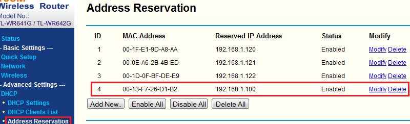
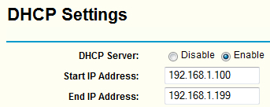
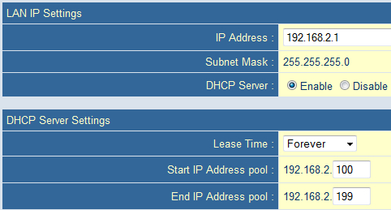
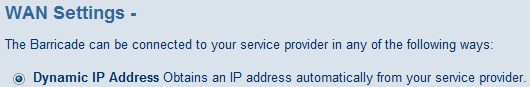

# Routerek karöltve (LAN-WAN)
TP-Link TL-WR642G és SMC 7004VBR

Hálózati elemek:
* 2 router
* Hálózati kábel (CAT5e patch kábel)
* _És a többi eszköz, ha használni is szeretnénk valamire a hálózatot._

Itt abból indulok ki, hogy az első router (TP-Link) sikeresen konfigurálva lett. Ne csatlakoztassunk semmit, csak ha már végeztünk a beállításokkal!

## Első router

Annak ellenére, hogy már konfiguráltuk az első routert, még meg kell tennünk valamit. **Ki kell adni a második router számára egy fix IP-címet**.

Ami nagyon lényeges, hogy az első router **192.168.1.100-199**-es tartományban osztja az IP-t:

Ezzel végeztünk is az első routernél.

## Második router

A második routeren is ellenőrizzük a DHCP beállításokat!

Látható, hogy a router a **192.168.2.100-199**-es tartományban osztja az IP-t. Ezzel kerülhetjük el, hogy "összebalhézzanak".

Következhet a **WAN** beállítása, hiszen ebbe torkollik az első router egyik LAN csatlakozójáról az UTP kábel.

Végtelenül egyszerű a dolgunk, csupán dinamikus címkérésre kell állítanunk. Az első routerben lefoglaltunk számára egy IP-t (192.168.1.100), az átjárója az első router lesz (192.168.1.1), a DNS-ek pedig lekéri az első routertől.

**Ha ezekkel végeztünk, húzzunk ki egy UTP kábel az első router egyik LAN portjából a második router WAN portjába!**

> Ha a második routeren kikapcsoljuk a DHCP-t, akkor egy egyszerű switchet kapunk, ebben az esetben LAN-LAN összekötésre van szükségünk.